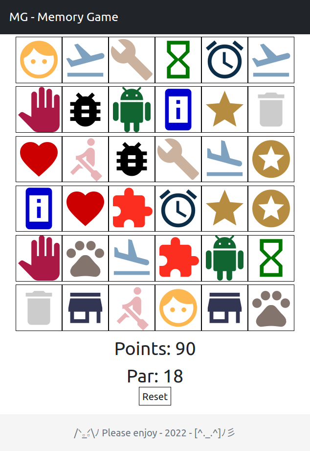

# MG - Memory Game

## What this is?
This is a fantastic memory game, or almost it...

## Install

### [NPM](https://www.npmjs.com/)
My case, on debian: `apt install npm`.

### [Parcel](https://parceljs.org/)
My case, on npm: `npm install -g parcel-bundler`.

## Dependency

### [Bootstrap](https://www.npmjs.com/package/bootstrap)
Quickly design and customize responsive mobile-first sites with Bootstrap, the world’s most popular front-end open source toolkit, featuring Sass variables and mixins, responsive grid system, extensive prebuilt components, and powerful JavaScript plugins.

### [Jquery](https://www.npmjs.com/package/jquery)
jQuery is a fast, small, and feature-rich JavaScript library. It makes things like HTML document traversal and manipulation, event handling, animation, and Ajax much simpler with an easy-to-use API that works across a multitude of browsers. With a combination of versatility and extensibility, jQuery has changed the way that millions of people write JavaScript.

### [Google Material Icons](https://fonts.google.com/icons?selected=Material+Icons)
Material Icons are available in five styles and a range of downloadable sizes and densities. The icons are based on the core Material Design principles and metrics.

## Run app
Execute: `parcel index.html`

## Screen

## Obs: Dev
`/ᐠ𝅒_𝅒ᐟ\ﾉ` The intent of this game is unprofessional so some bugs were tolerated, however please enjoy. `[^._.^]ﾉ彡`